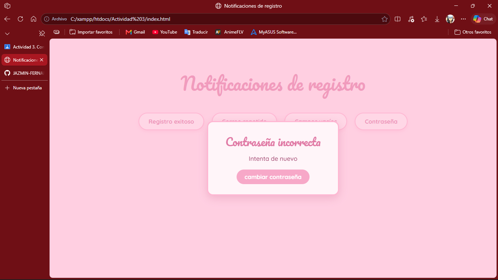

# Modal de notificaciones
ACTIVIDAD 3
Que problema se resulve
muestra notificaciones al usuario de registro, errores, avisos, contraseña, 
solo se llama una funcion con el titulo, el mensaje y el texto del boton

en el html esta el

<link rel="stylesheet" href="css/componente.css">

agregue pars las letras del diseño,  esto en un <head></head>
<link href="https://fonts.googleapis.com/css2?family=Pacifico&family=Quicksand:wght@500;700&display=swap" rel="stylesheet">

con un texto personalizado
abrirModal("correo ya registrado", "intenta de nuevo");

desde un boton en html
 <button onclick="abrirModal('faltan datos','completa todos los cambos', 'revisa')"> 
</button>

aqui el codigo explicado detalladamente 

// Esta función sirve para mostrar una ventana modal en la página.
// Recibe tres cosas: el título, el mensaje y el texto que va en el botón.
// Si no le pongo texto al botón, por defecto dice "Cerrar".
function abrirModal(titulo, contenido, textoBoton = "Cerrar") {

  // Primero busco si ya hay un modal abierto en la página.
  // Si lo hay, lo borro para que no se junten varios uno sobre otro.
  const anterior = document.querySelector(".modal-fondo");
  if (anterior) anterior.remove();

  // creo el fondo con un div nuevo que cubre toda la pantalla.
  // Le pongo la clase modal-fondo para que el CSS le dé su estilo.
  const fondo = document.createElement("div");
  fondo.className = "modal-fondo";

  // Dentro del fondo meto la caja del modal, con un título h2
  // un mensaje p y un botón. El título y el mensaje los dejo vacíos
  // porque los lleno en el siguiente paso.
  fondo.innerHTML = `
    

      <h2></h2>
      

      <button>${textoBoton}</button>
    

  `;

  //  Aquí es donde se personaliza el modal busco el h2 y el p
  // y les escribo lo que me mandaron al llamar la función.
  // Por eso el mismo modal puede decir cosas diferentes cada vez.
  fondo.querySelector("h2").textContent = titulo;
  fondo.querySelector("p").textContent = contenido;

  //  Le pongo las formas de cerrarse.
  // Si le dan clic al botón, el modal se quita de la página.
  fondo.querySelector("button").onclick = () => fondo.remove();

  // Si le dan clic a la parte de afuera el, también se cierra.
  // Uso el if para revisar que el clic fue en el fondo y no en la caja,
  // porque si no, se cerraría hasta al tocar el texto del modal.
  fondo.onclick = (e) => {
    if (e.target === fondo) fondo.remove();
  };

  // Hasta ahora el modal solo estaba creado en memoria.
  // Con esta línea lo agrego a la página y es cuando por fin aparece.
  document.body.appendChild(fondo);
}

Imagenes del registro de notificacones y al final el video

## Registro exitoso

## Correo ya registrado

## Campos vacíos

## Contraseña incorrecta

